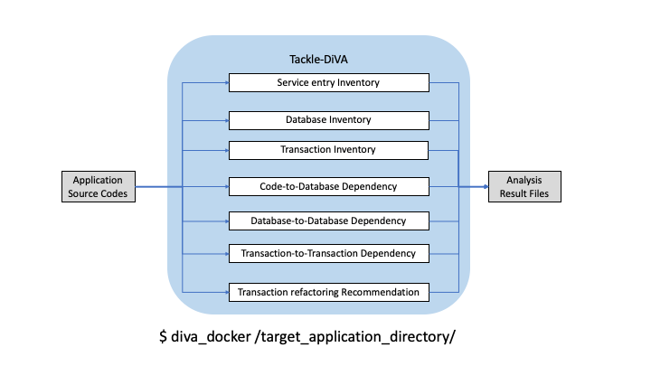

# Tackle-DiVA (Data-intensive Validity Analyzer)

Tackle-DiVA is a command-line tool for data-centric application analysis. It imports a set of target application source files (*.java/xml) and provides following analysis result files.

- Service entry (exported API) inventory 
- Database inventory
- Transaction inventory
- Code-to-Database dependencies (call graphs)
- Database-to-Database dependencies
- Transaction-to-Transaction dependencies
- Transaction refactoring recommendation.



## Prerequisites
- Docker runnable environment (e.g. RHEL, Ubuntu, macOS)


## Getting Started

Supposed that `tackle-diva` is cloned to `/tmp`,

0. Build docker image for diva.
```
$ cd /tmp/tackle-diva/
$ docker build . -t diva
```

1. Prepare source codes of target Java applications whose Java framework and database operation types meet DiVA, such as DayTrader7 application: https://github.com/WASdev/sample.daytrader7 
   
```
$ cd /tmp
$ git clone https://github.com/WASdev/sample.daytrader7.git
```

2. Move to `tackle-diva/distrib/bin/` directory, and execute `diva_docker` command attaching directory full path.

```
$ cd /tmp/tackle-diva/distrib/bin/
$ ./diva_docker /tmp/sample.daytrader7/
```

3. Check `tackle-diva/distrib/output` directory and confirm analysis result files
```
$ ls /tmp/tackle-diva/distrib/output
contexts.yml            transaction.json        transaction_summary.dot
database.json           transaction.yml         transaction_summary.pdf
```

## Analysis Results
An `output` directory for storing analysis result files:

- `contexts.yml`: Extracted application service entries
- `database.json`: Extracted database tables
- `transaction.json/yml`: Extracted transactions that expresses as a sequence of service entry, call graphs, SQLs
- `transaction_summary.dot/pdf`: Extracted database-to-database/transaction-to-transaction dependencies and recommended transaction refactoring.

## Supported Java Application Frameworks

- Servlet
  
The other frameworks to be supported (e.g. SpringBoot)

## Supported Database Operation Types

- SQLs via JDBC

The other types to be supported (e.g. JPA: Java Persistence API)
