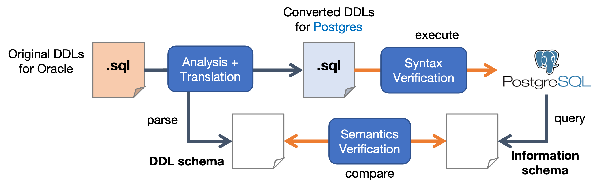

# DOA for Oracle (since v2.1.0)

In version 2.1.0, assessment and semi-automatic conversion of SQL DDL from **PL/SQL (a dialect used by Oracle DBMS)** to PostgreSQL is introduced.

> This document is specific for Oracle support. For general usage of DOA, see [README.md](README.md).

## Toolchain Pipeline

DOA convertion pipeline consists of:
- preprocessing 
- SQL file splitting
- Schema analysis (from original DDL)
- Conversion
- Syntax/Semantic verification

### Preprocessing 

Before analysis, DOA first performs the following preprocessing to each input file:

- Convert its encoding to UTF-8 using `nkf`.
- Convert line break to Unix style (`\n`) using `nkf`. 
- Convert alphabets to uppercase using `tr`.

The third one is to address the limitation of the current PL/SQL grammar. It may be changed in future version.

### SQL file splitting

Then each SQL files are splitted into separated files by each SQL statements for syntax verification described later.

### Schema analysis (from original DDL)

DOA analyzes the SQL files and extract information of database schema that are created by the files. Especially it analyzes FK (Foreign Key)/PK (Primary Key) relations.

### Conversion

DOA parses each SQL file and converts it to one for PostgreSQL.
It shows statistics of PL/SQL dialects found during conversion.

### Verification

Verification phase checks if the converted SQL preserves their semantics.
It consists of *syntax* and *semantic* verification.



<dl>
  <dt>Syntax Verification</dt>
    <dd>It checks if the converted SQLs are valid. DOA starts a PostgreSQL container and executes converted files (remember that each contains a single SQL statement) using the `psql` command, then checks if they are committed successfully.</dd>
  <dt>Semantic Verification</dt>
    <dd>DOA dynamically extracts schema information from the instance above using tables in `information_schema` schema, that is defined in SQL standards. DOA compares table names, column names and FK/PK relations with original schema information extracted the process above.
    </dd>
</dl>
----

## Example using Northwind

Let us try the PL/SQL file assessment using the **Northwind** example DB.
Northwind is the famous example DB application provided by Microsoft.
We include the PL/SQL version of DDL used in Northwind from an article by Binary World: http://binaryworld.net/blogs/northwind-database-creation-script-for-sql-server/

<!-- Being different from pulling application source from GitHub repo,
we need to specify `-f` option to make DiVA-DOA treat the argument as a directory name.
We also have to specify the dialect of the files using `-l` option, for which we specify `oracle`. -->

First clone the repository:

```bash
git clone https://github.com/konveyor/tackle-diva.git
```

If you have not installed DOA CLI yet, install it:

```bash
pip install --user ./tackle-diva/doa/python-doa-cli
```

Now let us convert Northwind DDL in the [examples](examples) directory as follows:

```
doa convert -i tackle-diva/doa/examples/northwind -o ./out
```

Conversion will be performed and the console output is similar to the following:

```
DiVA DOA CLI v2.4.0

[+] Running 1/0
 ⠿ Container doa_cli-db-1  Created                                                                       0.0s
[+] Running 1/1
 ⠿ Container doa_cli-db-1  Started                                                                       0.3s

DiVA DOA v2.4.0: Toolchain
running conversion pipeline...

──────────────────────────────────────── preprocessing and splitting ─────────────────────────────────────────
splitting files in /opt/in (preprocess = True)...
preprocessing files in /opt/in...
1 files are preprocessed and saved in /tmp/tmprqv9mr0y.

splitting...
original 1 file(s) are split into 13 files, saved in /tmp/tmpuklnrcm6.
split info saved in /tmp/tmpuklnrcm6/physical-info.yaml.
(3.03s)

──────────────────────────────────────────────── SQL analysis ────────────────────────────────────────────────
analyzing SQL files of schema 'northwind' (preprocess = False)...

13 file(s) are analyzed.
  13 table(s) are defined
  14 FK/PK relations are found

analysis result /tmp/tmpuklnrcm6/schema-info.yaml has been saved.
(2.70s)

─────────────────────────────────────────────── SQL conversion ───────────────────────────────────────────────
converting SQL files of app "northwind" in /tmp/tmpuklnrcm6...

Analysis results:

Total number of SQL files: 13

Number of SQL files (Oracle dialects): 13 (100.0%)
Number of SQL files (Generic): 0 (0.0%)

Number of SQLs automatically translated for Postgres: 13 (100.0%)
Number of SQLs requires manual revisions: 0 (0.0%)
  Local Index: 0
  Bitmap Index: 0

stats file /opt/out/stats.json has been generated.
(3.33s)

─────────────────────────────────────────── syntactic verification ───────────────────────────────────────────
starting syntax verification for files in /opt/out...

Number of converted SQLs (for Postgres): 13
Syntax verification results:
  Success: 13 (100.00%)
  Failure: 0 (  0.00%)

verification results /opt/out/syntax-verification.yaml has been saved.
(0.78s)

─────────────────────────────────────────── semantic verification ────────────────────────────────────────────
starting semantics verification...
looking for and analyzing tables...

Analysis results:

13 table(s) are found
14 FK/PK relations are found

Table preservation (Dice similarity): 100.00%
FK/PK preservation (avg. Dice similarity): 100.00%

verification results /opt/out/semantics-verification.yaml has been saved.
(0.14s)

[OK] toolchain completed. (10.02s)
[+] Running 1/1
 ⠿ Container doa_cli-db-1  Stopped                                                                       0.1s
```

Here statistics are shown, which includes total number of files, ones with/without Oracle dialects, and possibility of automatic conversion that preserves its semantics.
Verification results is also shown.
See [docs/conversion-analysis.md](docs/conversion-analysis.md) for detail.

When successfully executed, manifest files are generated in `./out`.
Statistics of assessment results are also generated in `./out`.
<!-- Note that application name will be "app" when `-f` is specified. -->

----

After the files are generated, continue from YAML generation in step (1) in [README](README.md) using the converted SQL files.

<!-- Here briefly introduces commands and results in the example:

```
cd ./output/app
```

```
bash create.sh
```

Output:

```
configmap/app-cm-init-db created
configmap/app-cm-sqls created
job.batch/app-init created
postgresql.acid.zalan.do/app-db created
```

```
kubectl get all
```

```
kubectl apply -f test/pod-test.yaml
```

Then, run `psql` and meta-command `\dt` on the test container:

```
kubectl exec app-test -it -- psql -h app-db -U postgres -c "\dt"
```

Output:

```
            List of relations
 Schema |     Name     | Type  |  Owner   
--------+--------------+-------+----------
 public | postgres_log | table | postgres
 public | table1       | table | postgres
 public | table2       | table | postgres
 public | table3       | table | postgres
(4 rows)
```

Delete test pod:

```
kubectl delete -f test/pod-test.yaml
```

Delete the cluster:

```
bash delete.sh 
``` -->
