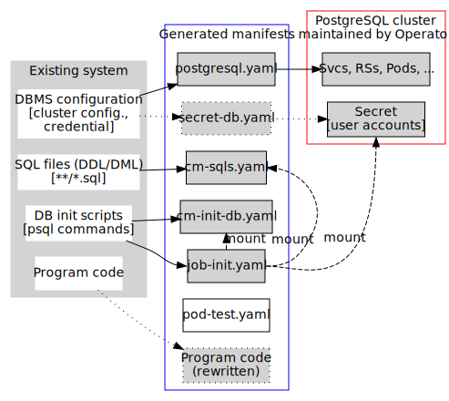

# Tackle-DiVA-DOA

Tackle-DiVA Database Operator Adaption (DiVA-DOA) toolchain. 

DiVA-DOA generates K8s resource definitions (YAML files) to help migration from an application with legacy DBMS system to cloud native environment that works with HA DB cluster.
It analyzes DBMS settings, DB definitions and initialization code in the application and generates resource definition files (YAML files) including one for the Postgres Operator, a K8s Operator for HA DB clusters.

DiVA-DOA has several editions for specific database products.
- [DOA for Oracle](README-Oracle.md)




# Prerequisites

To try Quickstart, make sure that 

- A `minikube` or any other K8s cluster is started.
- Helm is installed.
- Postgres Operator (https://github.com/zalando/postgres-operator) is installed using Helm on `default` namespace of the cluster.

When you use `minikube`, check if it is working as follows:

<details>
<summary>How to check if you're using `minikube`</summary>

```bash
$ minikube status # check minikube status
minikube
type: Control Plane
host: Running
kubelet: Running
apiserver: Running
kubeconfig: Configured

$ kubectl cluster-info # check kubectl status
Kubernetes control plane is running at https://127.0.0.1:64533
CoreDNS is running at https://127.0.0.1:64533/api/v1/namespaces/kube-system/services/kube-dns:dns/proxy

To further debug and diagnose cluster problems, use 'kubectl cluster-info dump'.

$ helm version # check helm status
version.BuildInfo{Version:"v3.7.2", GitCommit:"663a896f4a815053445eec4153677ddc24a0a361", GitTreeState:"clean", GoVersion:"go1.17.3"}

$ helm list --filter 'postgres-operator' # check Postgres Operator
NAME                	NAMESPACE	REVISION	UPDATED                             	STATUS  	CHART                     	APP VERSION
postgres-operator   	default  	1       	2022-01-18 16:31:31.614054 +0900 JST	deployed	postgres-operator-1.7.1   	1.7.1      
postgres-operator-ui	default  	1       	2022-01-18 16:31:33.573745 +0900 JST	deployed	postgres-operator-ui-1.7.1	1.7.1      
```

`bash util/show-status.sh` to dump status shown above.

You can also check if UI of the operator is working using `minikube service`:

```bash
$ minikube service postgres-operator-ui
(messages shown) # a browser window for operator UI opens
(type Ctrl-C to terminate)
```

Note that `minikube service postgres-operator-ui` automatically opens a window for UI on your default browser, while `minikube service postgres-operator-ui --url` does not, just showing the expoed URL.
</details>


See [util/start-minikube.sh](util/start-minikube.sh) to (stop and) start a new minikube cluster and install operators using `bash` on macOS.

# Quickstart

Let us demonstrate the toolchain to adapt a `trading-app` app by saud-aslam (https://github.com/saud-aslam/trading-app).

## (0) Build `diva-doa` docker image

Clone this repository and go to `doa` directory.

```bash
$ cd /tmp
$ git clone https://github.com/konveyor/tackle-diva.git
$ cd tackle-diva/doa
```

Build an image, needed to run just once.

```bash
$ bash util/build.sh

$ docker image ls diva-doa
REPOSITORY   TAG       IMAGE ID       CREATED        SIZE
diva-doa     2.0.0     5f9dd8f9f0eb   19 hours ago   1.27GB
diva-doa     latest    5f9dd8f9f0eb   19 hours ago   1.27GB
```

## (1) Analyze target app and generate manifests

> If you want to **DOA for Oracle** functionality inroduced in v2.1.0, see [README-Oracle.md](README-Oracle.md).

To analyze `trading-app`, executing the wrapper script `run-doa.sh` with arguments:

```bash
$ bash ./run-doa.sh -o /tmp/out -i start_up.sh https://github.com/saud-aslam/trading-app
--------------------
DiVA-DOA wrapper
--------------------

running container diva-doa:latest...

------------------------
DiVA-DOA v2.0.0
------------------------
...

[OK] successfully completed.
```

This code analyzes an app at https://github.com/saud-aslam/trading-app and outputs generated files under `/tmp/out/<app-name>` directory, where `<app-name>` is obtained from the repository name and a child directory of one specified by `-i` option.
You can specify any directory with the `-i` option.

In current version, you need to specify (by `-i` option) a file under the repository from which DB initializatoin code will be extracted. Currently only shell script file can be supported.

Here shows the generated files:

```bash
$ ls -lFR --color /tmp/out/trading-app
/tmp/out/trading-app:
total 24
-rw-r--r-- 1 shinsa wheel  258  1 27 22:21 cm-init-db.yaml
-rw-r--r-- 1 shinsa wheel 2366  1 27 22:21 cm-sqls.yaml
-rwxr-xr-x 1 shinsa wheel   90  1 27 22:21 create.sh*
-rwxr-xr-x 1 shinsa wheel   84  1 27 22:21 delete.sh*
-rw-r--r-- 1 shinsa wheel 1212  1 27 22:21 job-init.yaml
-rw-r--r-- 1 shinsa wheel  259  1 27 22:21 postgres.yaml
drwxr-xr-x 3 shinsa wheel   96  1 27 22:21 test/

/tmp/out/trading-app/test:
total 4
-rw-r--r-- 1 shinsa wheel 1210  1 27 22:21 pod-test.yaml
```

## (2) Create resources on a K8a cluster

Then let us create resources using the generated manifests. Since utility script is also generated, you can use it:

```bash
$ cd /tmp/out/trading-app
$ bash create.sh # or kubectl apply -f .
configmap/trading-app-cm-init-db created
configmap/trading-app-cm-sqls created
job.batch/trading-app-init created
postgresql.acid.zalan.do/trading-app-db created
```

Then you can check resources' status by `kubectl get`:

```bash
$ kubectl get all 

# or 

$ kubectl get postgresql,all,cm,secret,pv,pvc  # more detailed
```

<details>
<summary>Command output sample</summary>

```bash
$ kubectl get postgresql,all,cm,secret,pv,pvc
NAME                                      TEAM          VERSION   PODS   VOLUME   CPU-REQUEST   MEMORY-REQUEST   AGE     STATUS
postgresql.acid.zalan.do/trading-app-db   trading-app   13        4      1Gi                                     3m57s   Running

NAME                                        READY   STATUS      RESTARTS   AGE
pod/postgres-operator-594c75b5fc-7nn6m      1/1     Running     0          4m23s
pod/postgres-operator-ui-58644cfcff-9nr44   1/1     Running     0          4m23s
pod/trading-app-db-0                        1/1     Running     0          3m1s
pod/trading-app-db-1                        1/1     Running     0          2m4s
pod/trading-app-db-2                        1/1     Running     0          2m2s
pod/trading-app-db-3                        1/1     Running     0          119s
pod/trading-app-init--1-g2xg9               0/1     Completed   4          3m57s

NAME                            TYPE        CLUSTER-IP       EXTERNAL-IP   PORT(S)    AGE
service/kubernetes              ClusterIP   10.96.0.1        <none>        443/TCP    4m37s
service/postgres-operator       ClusterIP   10.106.196.192   <none>        8080/TCP   4m26s
service/postgres-operator-ui    ClusterIP   10.109.57.193    <none>        80/TCP     4m24s
service/trading-app-db          ClusterIP   10.105.79.165    <none>        5432/TCP   3m3s
service/trading-app-db-config   ClusterIP   None             <none>        <none>     2m1s
service/trading-app-db-repl     ClusterIP   10.102.149.79    <none>        5432/TCP   3m2s

NAME                                   READY   UP-TO-DATE   AVAILABLE   AGE
deployment.apps/postgres-operator      1/1     1            1           4m26s
deployment.apps/postgres-operator-ui   1/1     1            1           4m24s

NAME                                              DESIRED   CURRENT   READY   AGE
replicaset.apps/postgres-operator-594c75b5fc      1         1         1       4m23s
replicaset.apps/postgres-operator-ui-58644cfcff   1         1         1       4m23s

NAME                              READY   AGE
statefulset.apps/trading-app-db   4/4     3m1s

NAME                         COMPLETIONS   DURATION   AGE
job.batch/trading-app-init   1/1           2m34s      3m57s

NAME                                                    IMAGE                                               CLUSTER-LABEL   SERVICE-ACCOUNT   MIN-INSTANCES   AGE
operatorconfiguration.acid.zalan.do/postgres-operator   registry.opensource.zalan.do/acid/spilo-14:2.1-p3   cluster-name    postgres-pod      -1              4m26s

NAME                               DATA   AGE
configmap/kube-root-ca.crt         1      4m23s
configmap/trading-app-cm-init-db   1      3m57s
configmap/trading-app-cm-sqls      2      3m57s

NAME                                                                  TYPE                                  DATA   AGE
secret/default-token-zbbtk                                            kubernetes.io/service-account-token   3      4m23s
secret/postgres-operator-token-6rsqc                                  kubernetes.io/service-account-token   3      4m26s
secret/postgres-operator-ui-token-vfksr                               kubernetes.io/service-account-token   3      4m24s
secret/postgres-pod-token-ct7vm                                       kubernetes.io/service-account-token   3      3m3s
secret/postgres.trading-app-db.credentials.postgresql.acid.zalan.do   Opaque                                2      3m3s
secret/sh.helm.release.v1.postgres-operator-ui.v1                     helm.sh/release.v1                    1      4m24s
secret/sh.helm.release.v1.postgres-operator.v1                        helm.sh/release.v1                    1      4m26s
secret/standby.trading-app-db.credentials.postgresql.acid.zalan.do    Opaque                                2      3m3s

NAME                                                        CAPACITY   ACCESS MODES   RECLAIM POLICY   STATUS   CLAIM                             STORAGECLASS   REASON   AGE
persistentvolume/pvc-0b7cc79b-18dc-4e21-ad40-95a0c4fdaa35   1Gi        RWO            Delete           Bound    default/pgdata-trading-app-db-3   standard                119s
persistentvolume/pvc-74301e09-96c4-4bc8-9539-8c2b2846d69b   1Gi        RWO            Delete           Bound    default/pgdata-trading-app-db-2   standard                2m2s
persistentvolume/pvc-8df7aa00-51b9-49f6-a3d1-89d573f74371   1Gi        RWO            Delete           Bound    default/pgdata-trading-app-db-1   standard                2m4s
persistentvolume/pvc-ea6e1c59-f9b6-44f8-bdf6-1efef059226b   1Gi        RWO            Delete           Bound    default/pgdata-trading-app-db-0   standard                3m1s

NAME                                            STATUS   VOLUME                                     CAPACITY   ACCESS MODES   STORAGECLASS   AGE
persistentvolumeclaim/pgdata-trading-app-db-0   Bound    pvc-ea6e1c59-f9b6-44f8-bdf6-1efef059226b   1Gi        RWO            standard       3m2s
persistentvolumeclaim/pgdata-trading-app-db-1   Bound    pvc-8df7aa00-51b9-49f6-a3d1-89d573f74371   1Gi        RWO            standard       2m5s
persistentvolumeclaim/pgdata-trading-app-db-2   Bound    pvc-74301e09-96c4-4bc8-9539-8c2b2846d69b   1Gi        RWO            standard       2m3s
persistentvolumeclaim/pgdata-trading-app-db-3   Bound    pvc-0b7cc79b-18dc-4e21-ad40-95a0c4fdaa35   1Gi        RWO            standard       2m
```
</details>

For example, there should be 4 PostgreSQL instance Pods, one of which is a master and others are replica:

```bash
$ kubectl get po -l cluster-name=trading-app-db -L cluster-name -L spilo-role
NAME               READY   STATUS    RESTARTS   AGE     CLUSTER-NAME     SPILO-ROLE
trading-app-db-0   1/1     Running   0          6m32s   trading-app-db   master
trading-app-db-1   1/1     Running   0          5m35s   trading-app-db   replica
trading-app-db-2   1/1     Running   0          5m33s   trading-app-db   replica
trading-app-db-3   1/1     Running   0          5m30s   trading-app-db   replica
```

---

**Note: before proceeding, you need to wait until the initialization Job and Pod finishes before proceeding:**

```bash
# wait until STATUS of trading-app-init Pod becomes "Completed"
$ kubectl get pod -l job-name=trading-app-init
NAME                        READY   STATUS      RESTARTS   AGE
trading-app-init--1-z4zhc   0/1     Completed   4          8m18s
```

You can see log of the init Pod by:

```
kubectl logs -l job-name=app-init
```

Output is like:

```
executing /app/sqls/doa-sample-1.sql...
CREATE TABLE
executing /app/sqls/doa-sample-2.sql...
CREATE TABLE
executing /app/sqls/doa-sample-3.sql...
CREATE TABLE
```

## (3) Check if the databases has been successfully created

### (3.1) Check via Postgres Operator UI

First you can confirm if the databases are created via operator UI:

```bash
$ minikube service postgres-operator-ui
(some messages shown) # a browser window for operator UI opens
```

It shows a UI of Postgres Operator in your browser. Clicking `PostgerSQL clusters` at top navigation shows the cluster that you have created. You can see its status and logs using the UI.
**In particular, you can see a message "cluster has been created" on the first line of log of the cluster.**

After you check, close the window and type `Ctrl-C` in your console to terminate `minikube service`.

### (3.2) Check via `psql` command

Next, let us check databases and tables using CLI.
You can use a Pod definition for test, which comes with generated manifests:

```bash
$ cd /tmp/out/trading-app
$ kubectl apply -f test/pod-test.yaml # creates a test Pod
pod/trading-app-test created
$ kubectl exec trading-app-test -it -- bash  # login to the pod
```

In the pod, environment variables `DB_HOST` and `PGPASSWORD` are already set.

```
# printenv DB_HOST
diva-trading-app-db
# printenv PGPASSWORD
(password is shown)
```

So you can connect to databases and check if databases, tables, and views are successfully created.
Connect to cluster and database `jrvstrading` by 

```
# psql -h ${DB_HOST} -U postgres -d jrvstrading 
```

or connect to DBMS without specifying database and issue `\c` command:

```
# psql -h ${DB_HOST} -U postgres
postgres=# \c jrvstrading  # connect to database
```

and browse stuff:

```
jrvstrading=# \dt  # show tables
             List of relations
 Schema |      Name      | Type  |  Owner   
--------+----------------+-------+----------
 public | account        | table | postgres
 public | quote          | table | postgres
 public | security_order | table | postgres
 public | trader         | table | postgres
(4 rows)

jrvstrading-# \dv  # show views
                List of relations
 Schema |         Name          | Type |  Owner   
--------+-----------------------+------+----------
 public | pg_stat_kcache        | view | postgres
 public | pg_stat_kcache_detail | view | postgres
 public | pg_stat_statements    | view | postgres
 public | position              | view | postgres
(4 rows)

jrvstrading-# \q  # quit psql
$ exit         # (or Ctrl-D) to logout from the Pod
```

When checking is done, delete the test Pod:

```bash
$ kubectl delete -f test/pod-test.yaml
pod "trading-app-test" deleted
```

## (4) Delete resources created by step (2)

Executing `/tmp/out/trading-app/delete.sh` deletes all resources created by `create.sh`.

```bash
$ cd /tmp/out/trading-app
$ bash delete.sh 
configmap "trading-app-cm-init-db" deleted
configmap "trading-app-cm-sqls" deleted
job.batch "trading-app-init" deleted
postgresql.acid.zalan.do "trading-app-db" deleted
```

That's all for the demonstration.

# For developers

See [docs/README.md](docs/README.md) for a design document and development policy.
  
# Materials
- [Youtube recording](https://youtu.be/61e9DjonrZs)

