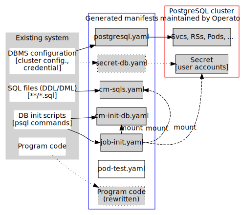

# Development Policy, Design Document and Implementation

This is a document for architecture and development convention.

# Notation

We write [${ROOT}](..) for directory `tackle-diva/doa` of the `tackle-diva` repository.

# Architecture Overview

Files related to DOA is just as follows:

- ${ROOT} (`tackle-diva/doa`)
  - [doa/](..): Root directory of DOA. All resources for developing/deploying DOA is here.
  - [python-doa-cli/](../doa-cli): A Python library for the frontend CLI.
  - [python-doa-lib/](../doa-lib): A Python library that implements DOA main logic. You can install it by `pip install [-e] python-doa-lib`. It is also installed in the `diva-doa` container.

- [doa/](../doa-cli) is a frontend CLI as an Python package. This starts `diva-doa` container 
  - [doa-cli/](../doa-cli) is a frontend CLI as an Python package. This starts `diva-doa` container and run one of the main scripts below.
  - [doa/](../doa) contains main logic, that will be mounted on `/work` in the `diva-doa` containter.
    - [sqal](../doa/sqal) is an original Python package for SQL analysis, that is installed in the `diva-doa` container.
    - [translate.sh](../doa/translate.sh) is the main script for SQL conversion.
    - [migrate.sh](../doa/migrate.sh) is the main script for generation of YAMLs.
    - [verify.sh](../doa/verify.sh) is the main script for SQL migration verification.

# Development Environment

Use Dev-container (a function of VS Code) to development code run in `diva-doa` container.

- Start up VS Code in the repository root and select "ReOpen in Container".
- In the dev container, repository directory `diva-doa` is mounted on `/workspace/diva-doa` and you are there.
  - You can run main logic, `doa/migrate.sh`, directly like:
      ```bash
      bash /workspace/diva-doa/doa/migrate.sh -i start_up.sh -o /tmp/out https://github.com/saud-aslam/trading-app
      ls -R /tmp/out  # list generated files
      ```

## Recommended Python libraries

- Use `poetry` (https://python-poetry.org/) to manage dependency and installation.
    - It's fast and it can resolve complex dependencies that pip cannot.
    - Virtial env. management is integrated.
- Use `typer` (https://typer.tiangolo.com/) to implement CLI.
    - Type based: easy to read, code and test.
    - Automatically creates shell-completion files.

## File Generation

Some files are generated by `jinja2` template engine. The templates are in `${ROOT}/in` and variables are in `${ROOT}/env.yaml`. 

To build files,

```bash
$ bash ${ROOT}/util/filegen.sh
```

## Document Generation 

Diagrams in this document are generated by [Graphviz](https://graphviz.org/).

To generate diagrams,

```bash
$ bash ${ROOT}/docs/build.sh  # in docs directory, not in util directory
```

## Past Releases/Tags

- `v1.0.0`: Internal first release. (Nov., 2021)
- `v2.0.0`: The second release (and the first public release). (Jan., 2022)

The CHANGELOG file will be provided later.


----
# Architecture

Legend:
- Dotted line: unimplemented.
- Dashed line: reference.

The figure below shows an architecture overview of DiVA-DOA.
See [Main Logic](#main-logic) section below for (1) and (2) in the diagram.



## (*) DBMS config. analysis

None

## (1) SQL file analysis

Implemented in a Python program `${WORK}/analyzers/analyze_sqls.py`.

- Glob `${APP_ROOT}/**/*.sql` files under the root of the target app (using Python `iglob`).
- Genrate manifest(s) of ConfigMap resource(s) that contains **basename** of each SQL file as a key and file content as a value. This is done by `kubectl create cm <name> --from-file ... -o yaml --dry-run=client`.
 
For exaample,
```
${APP_ROOT}
└── ddl/
    ├── foo.sql
    └── bar.sql
```

Then a manifest file for ConfigMap that contains `foo.sql` and `bar.sql` as its keys.

### Possible Issues:

- Since only basenames are stored as key, it does not work in the situation like
  - SQL files `${APP_ROOT}/foo.sql` and `${APP_ROOT}/ddl/foo.sql` exist.

## (2) DB init script analysis

DiVA needs to know how to execute SQL scripts that are found the step (2).

- Current implementation extracts lines that contain `psql` command. from the file that the user specified by `-i` option (e.g., `migrate.sh -i start-up.sh ...`).
- It parses `psql` arguments (using Lark library) and rewrites host name and user name to work in container environment.
  - Typical syntax: `psql -h <host> -U <user> -d <database> -f <sql-file>`

### Possible Issues:

- Current implementation contains hardcode portion and is not flexible.
- Often such command lines are included in README files...

## (*) Program code analysis and transformation

- To appear.
