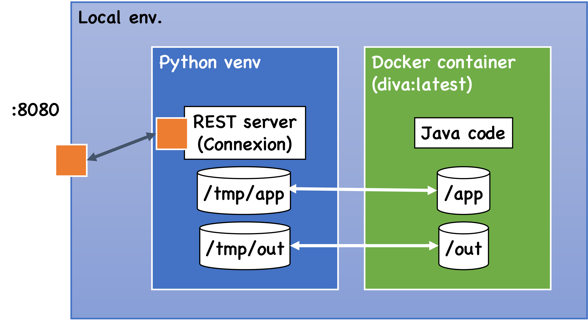

# REST Server Docker Image of Tackle-DiVA

- If you want to develop container version and to do integration test, see the section below.
- If you want to develop and test locally, go to the "Dev and test locally" section.

# Dev and test REST seever container

## Build a server image `diva-rest`

```shell
make build.base  # build diva-rest-base
make build       # build diva-rest
```

### For developer

Since `diva-rest-base` does not change so frequently, so you need not rebuild it every time when you build the server image `diva-rest`.

## Run a server container

Run this command to run a server container on port 8080:

```
make run
```

Alternatively, if you just want to enter a sever container with bash:

```
make run.shell
```

## Test server


### Deprecated: If you want to test at low-level 

> These will be moved to [../client](../client) later

```shell
curl localhost:8080                  # to access root, which causes an error
curl localhost:8080/transaction/foo  # to access TXs, which returns an warning text
curl -L localhost:8080/ui            # to access swagger UI
```

# Dev and test locally

Local dev. (and test) uses in-container Java app.



## Prereq

- `Python 3.7.x`
- `poetry` (package authoring manager for Python)
- `git` should be installed
- `docker` should be installed

## Setup 

At this directory,

- activate `Python 3.7.x` (e.g. like `pyenv local 3.7`), and
- run `poetry install`

to setup.

## Build

> No need to build.

## (Unit) test

This test runs an web server locally, run Java code in a container and tests.

```bash
poetry run pytest test
# or invoke each test script:
# poetry run pytest test/test_local_server.py
```

Testcases detail:
- `test/`
  - `test_local_server.py`: Tests REST APIs using local web server.
  - `test_impl.py`: Tests internal business logics.
  - `test_docker.py`: Tests invocation of Java analysis code using Docker container and Python `docker` package.

Some pytest options:
- `-v`: turn on verbose output (show each testcase name)
- `--capture=tee-sys`: show strout and stderr to screen
- `--log-cli-level=<LEVEL>`: show logs to screen

## Run

You can run web server locally (with debug mode):

```bash
make run.local
```

Then you can test the server using curl in another terminal, like this:

```bash
curl localhost:8080                  # to access root, which causes a 404 error

# analyze an app
curl -X POST localhost:8080/app -H "content-type: application/json" \
  -d '{"id": "day_trader", "name": "Day Trader (WAS)", \
  "source": {"github_url": "https://github.com/WASdev/sample.daytrader7.git"}}'

curl localhost:8080/transaction/foo  # to access TXs, which returns an warning text

# automatically generated APIs by connexion
curl -L localhost:8080/ui            # to access swagger UI
curl -L localhost:8080/openapi.json  # to access openapi.json
```
